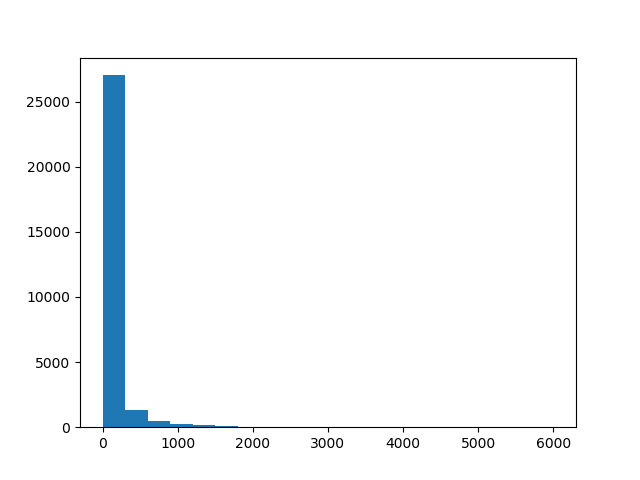
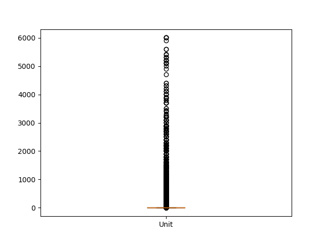

Unit Histogram, Q-Q plot, Boxplot
 

Number of Existing Stories Histogram, Q-Q plot, Boxplot
 

Number of Proposed Stories Histogram, Q-Q plot, Boxplot
 

Estimated Cost Histogram, Q-Q plot, Boxplot
 

Revised Cost Histogram, Q-Q plot, Boxplot
 

Proposed Units Histogram, Q-Q plot, Boxplot
 

Plansets Histogram, Q-Q plot, Boxplot
 
